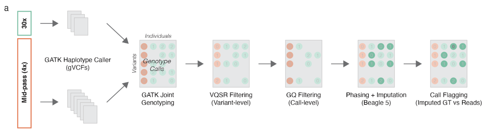
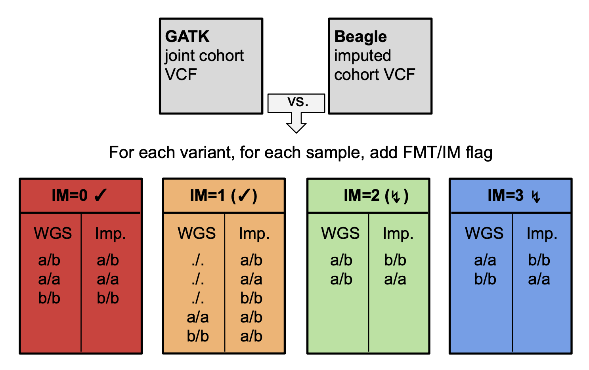
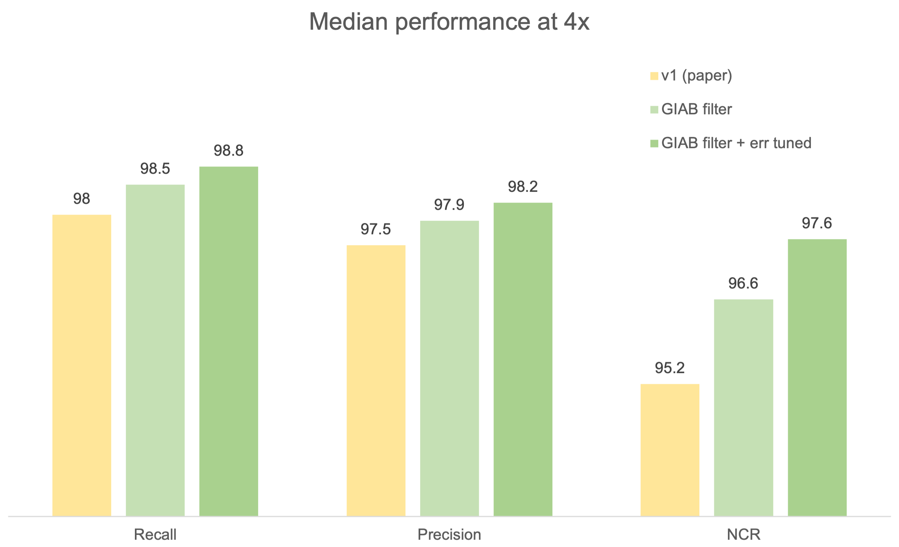

# Methods for mid-pass whole genome sequencing

This document provides an overview of the pipeline and how data were processed in our [manuscript](https://bmcgenomics.biomedcentral.com/articles/10.1186/s12864-021-07949-9) published in BMC Genomics. If you use this pipeline or the scripts developed here, please cite our work:

Emde, AK., Phipps-Green, A., Cadzow, M. et al. Mid-pass whole genome sequencing enables biomedical genetic studies of diverse populations. BMC Genomics 22, 666 (2021).

All code is freely available for academic and non-commercial research purposes [LICENSE](LICENSE.md).

## Processing workflow to generate fully phased and imputed VCF


 
 
## Preprocessing
Sample level processing down to GVCFs followed the GATK Best Practices guidelines as detailed [here](https://gatk.broadinstitute.org/hc/en-us/articles/360035535932-Germline-short-variant-discovery-SNPs-Indels-). Specifically, after adapter trimming with cutadapt v2.10, reads were mapped against GRCh38 with ALT contigs using BWA-mem v0.7.15. Subsequent steps for duplicate marking, sorting, base call quality recalibration and creating GVCFs with HaplotypeCaller were done with versions v2.14 of Picard, v1.10 of samtools, and v4.1.4.0 of GATK. Most steps were run with default parameter settings with few exceptions, e.g. to remove extremely short alignments. 

## Joint variant calling and site level filtering
Mid-pass (1-7x) GVCFs and 30x GVCFs were jointly genotyped (using GATK genomicsDBImport and GenotypeGVCFs, see commands below) to produce one multi-sample VCF that was subsequently run through VQSR (SNP sensitivity=99.8%, indel sensitivity=99%) for site-level filtering. Only PASS sites were used subsequently.

## GQ filtering and imputation
The PASS-only variant calls were further filtered to remove low quality genotype calls, to exclude those from potentially misguiding imputation.  By measuring imputation performance over varying GQ thresholds, we determined that keeping only genotypes with GQ>17 was optimal. All GT fields with GQ<=17 were hence set to "./." (this can be done for example with vcftools --minGQ (see [here](https://vcftools.github.io/man_latest.html)).
The resulting VCF file was then used as input to Beagle 5.1 using the “gt=” input parameter without reference panel (i.e. to impute within the provided cohort; see commands below).

## Call flagging
We finally compared the imputed genotypes with the sequencing-based calls before GQ filtering, in order to identify and flag calls where sequencing data (even if at low confidence) was in agreement or disagreement with the imputed call. The script for merging unfiltered and imputed VCF files is provided here ([flag_calls.py](flag_calls.py)). It annotates each genotype call with an IM value, where a lower values represents higher confidence in the call. Depending on the downstream application, these flags can be used to treat certain flagged variants with caution or filter them entirely.




A call is flagged with IM=0 if sequencing-based genotype and imputed genotype agree fully. IM=1 means the imputed call does not disagree with the sequencing-based call (either because it was missing or we may have only observed one of two alleles in sequencing). IM=2 and IM=3 flag sites with disagreement between sequencing-based and imputed calls, where IM=2 calls were heterozygous in sequencing (potentially due to sequencing errors or contamination) and IM=3 calls were homozygous. Especially IM=3 calls where sequencing and imputation disagree most strongly may better be excluded or further refined for downstream analysis. 

## Commands used for variant genotyping and imputation

HaplotypeCaller command used to generate GVCF for each sample:

```
gatk HaplotypeCaller -R /db/Homo_sapiens_assembly38.fasta \
        -I ${sample}.bam -O ${sample}.g.vcf.gz \
        -ERC GVCF --read-filter OverclippedReadFilter \
        --do-not-run-physical-phasing 
```

For single sample genotyping we ran GenotypeGVCFs on the individual .g.vcf.gz files without any further filtering of calls:

```
gatk GenotypeGVCFs --use-new-qual-calculator -R /db/Homo_sapiens_assembly38.fasta -V ${sample}.g.vcf.gz -O ${sample}.single.vcf.gz
```

For joint genotyping and variant quality filtering we used the following commands, splitting up the GATK-provided wgs_calling_regions.hg38.interval_list into chunks of 1.5Mbp or smaller, and merging the resulting VCFs into one cohort VCF before running VQSR:


```
gatk GenomicsDBImport \
        --genomicsdb-workspace-path database.${interval} \
        -L ${interval} \
        --batch-size 50 \
        --consolidate \
        --merge-input-intervals \
	${sample1}.g.vcf.gz ${sample2}.g.vcf.gz ... ${sampleN}.g.vcf.gz

gatk GenotypeGVCFs \
        --only-output-calls-starting-in-intervals \
        --use-new-qual-calculator \
        -R /db/Homo_sapiens_assembly38.fasta \
        -L ${interval} \
        --disable-bam-index-caching \
        -V gendb://database.${interval} \
        -O cohort.${interval}.vcf.gz

gatk MergeVcfs cohort.${interval1}.vcf.gz .... cohort.${intervalN}.vcf.gz \
        -O cohort.vcf.gz 

gatk VariantRecalibrator -V cohort.vcf.gz \
        -resource:hapmap,known=false,training=true,truth=true,prior=15.0 /db/hapmap_3.3.hg38.vcf.gz \
        -resource:omni,known=false,training=true,truth=true,prior=12.0 /db/1000G_omni2.5.hg38.vcf.gz \
        -resource:1000G,known=false,training=true,truth=false,prior=10.0 /db/1000G_phase1.snps.high_confidence.hg38.vcf.gz \
        -resource:dbsnp,known=true,training=false,truth=false,prior=2.0 /db/dbsnp_138.hg38.vcf.gz \
        -an QD -an MQ -an MQRankSum -an ReadPosRankSum -an FS -an SOR \
        -mode SNP --output vqsr.recal --tranches-file tranches.out \
        -tranche 100.0 -tranche 99.8 -tranche 99.6 -tranche 99.4 \
        -tranche 99.2 -tranche 99.0 -tranche 95.0 -tranche 90.0 \
        --reference /db/Homo_sapiens_assembly38.fasta
   
gatk VariantRecalibrator -V cohort.vcf.gz \
        -resource:mills,known=true,training=true,truth=true,prior=12.0 /db/Mills_and_1000G_gold_standard.indels.hg38.vcf.gz \
        -resource:dbsnp,known=true,training=false,truth=false,prior=2.0 /db/dbsnp_138.hg38.vcf.gz \
        -an QD -an FS -an SOR -an ReadPosRankSum -an MQRankSum  \
        -mode INDEL --output indel_vqsr.recal --tranches-file indel_tranches.out \
        --reference /db/Homo_sapiens_assembly38.fasta --max-gaussians 4 -tranche 100.0 -tranche 99.0 \
        -tranche 95.0 -tranche 92.0 -tranche 90.0 

gatk ApplyVQSR -V cohort.vcf.gz \
        -mode SNP --recal-file vqsr.recal --tranches-file tranches.out \
        --reference /db/Homo_sapiens_assembly38.fasta --truth-sensitivity-filter-level 99.8 \
        --output cohort.snprecal.vcf.gz

gatk ApplyVQSR -V cohort.snprecal.vcf.gz \
        -mode INDEL --recal-file indel_vqsr.recal --tranches-file indel_tranches.out \
        --reference /db/Homo_sapiens_assembly38.fasta --truth-sensitivity-filter-level 99.0 \
        --output cohort.vqsr.vcf.gz
 
bcftools view -f PASS cohort.vqsr.vcf.gz -O z > joint.vcf.gz 
```

Finally, the following commands were used for call-level GQ filtering, Beagle within-cohort imputation and call flagging (split up by chromosome):

```
vcftools --minGQ 18 --gzvcf joint.${chr}.vcf.gz --stdout --recode | bgzip -c > joint.${chr}.gtGQ17.vcf.gz

java -Xmx54g -jar beagle.27Apr20.b81.jar nthreads=8 chrom=${chr} gp=true map=plink.${chr}.GRCh38.map gt=joint.${chr}.gtGQ17.vcf.gz out=joint.${chr}.imputed

python flag_calls.py joint.${chr}.vcf.gz joint.${chr}.imputed.vcf.gz | bgzip -c > joint.${chr}.imputed.flagged.vcf.gz
```

Plink chromosomes maps for GRCh38 are available from the Beagle website https://faculty.washington.edu/browning/beagle/beagle.html


## Performance assessment

We assessed recall and precision for called variant sites and non-reference concordance rate (NCR = 1-NDR) of genotype calls for each test sample. The following code snippets detail the commands used to subset test and "truth" VCF files using bcftools (v1.10). This was done for each sample, variant type (snps|indels) and within HC regions or otherwise genomewide.

```# extract sample “truth” calls
bcftools view [-R $regions] -s $sample -v $type joint.truth.vcf.gz | bcftools view -i ‘FMT/GQ>20’ | bgzip -c > $sample.truth.vcf.gz
bcftools view -c 1 $sample.truth.vcf.gz | bgzip -c > $sample.truth.sites.vcf.gz

## extract sample test calls - different cases for different experiments
# 1. from imputed VCF
bcftools view [-R $regions] -s $sample -v $type joint.imputed.vcf.gz | bgzip -c > $sample.vcf.gz

# 2. from jointly genotyped PASS filter VCF
bcftools view [-R $regions] -s $sample -v $type joint.vcf.gz | bcftools view -i ‘FMT/GQ>17’ | bgzip -c > $sample.vcf.gz

# 3. from single sample VCF
bcftools view [-R $regions] -v $type $sample.single.vcf.gz | bcftools view -i ‘FMT/GQ>17’ | bgzip -c > $sample.vcf.gz
```

The different test VCFs were then compared to the corresponding sample truth VCFs to examine site recall and precision as well as genotype accuracy, using vcf-compare (v0.1.14-12-gcdb80b8).

```
# get only those sites where sample has a non-ref allele
bcftools view -c 1 $sample.vcf.gz > $sample.sites.vcf.gz

# site comparison for recall/precision 
vcf-compare $sample.truth.sites.vcf.gz $sample.sites.vcf.gz | grep ^VN

# genotype comparison for NCR = 1-NDR
vcf-compare -g $sample.truth.vcf.gz $sample.vcf.gz | grep -A 1 ^GS
```
## Publicly available mid-pass data for benchmarking

Sequencing data from 120 libraries generated for the 12 HapMap individuals has been deposited to the Sequence Read Archive under acessession [PRJNA697982](https://www.ncbi.nlm.nih.gov/bioproject/PRJNA697982/). Briefly, 4 replicate libraries were generated using the [plexWell LPS384](https://seqwell.com/products/plexwell-lp-384/) library preparation kit (designed for low-pass applications), and 2 replicate libraries were generated using the [plexWell WGS24](https://seqwell.com/products/plexwell-wgs-24/) library preparation kit (designed for high-pass applications). LPS384 libraries were sequenced at target coverages of 1x and 4x, and WGS24 libraries were sequenced at a target coverage of 4x.

## Updated benchmarking results

Since writing the article presenting the workflow above, we have further tuned and optimized the pipeline for mid-pass data. Here we share the two major strategies we have identified that significantly improve performance:

1. Stricter site-level filtering pre-imputation: restricting variant calls to the GIAB “easy” regions<sup>[1](#footnotegiab)</sup>
 before imputation improves all metrics. Note that other methods for site-level filtering<sup>[2](#footnotefilter)</sup> may have similar effects while filtering less of the genome.

2. Beagle parameter tuning: among several parameters tested, the biggest and most robust impact was seen with the error rate parameter (“err”). Rather than using the default (which estimates from the data), we have found that setting err to 0.05-0.1 gives significant and robust improvements in all metrics.

Combining these two strategies and applying to the same cohort as in the paper, we reach 98.8% recall, 98.2% precision, and 97.6% NCR for samples at 4x coverage:




<a name="footnotegiab">1</a>: GRCh38_notinalldifficultregions.bed as described in https://opendata.nist.gov/pdrsrv/mds2-2190/GRCh38/union/v2.0-GRCh38-Union-README.txt 

<a name="footnotefilter">2</a>: https://www.illumina.com/science/genomics-research/articles/identifying-genomic-regions-with-high-quality-single-nucleotide-.html

